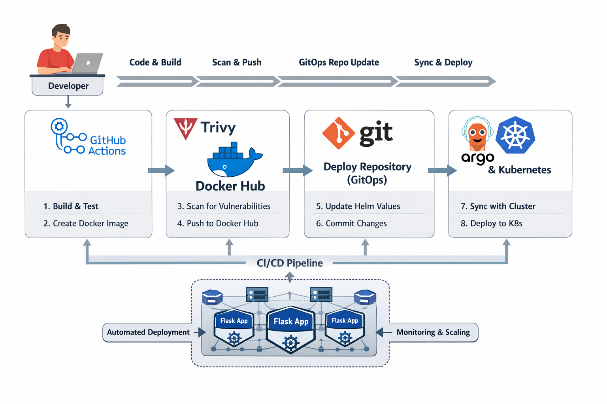

# 🚀 Flask CD Pipeline with Argo CD (GitOps Deployment)

This repository implements the **Continuous Deployment (CD)** part of a modern DevOps pipeline using **Argo CD** and **Kubernetes** following the **GitOps approach**.

It works together with the CI repository, where Docker images are built and pushed to Docker Hub. This repository is responsible for deploying those images to Kubernetes.




---

## 📊 Architecture Overview

This project follows a **GitOps-based deployment model**:

```text
GitHub Actions (CI) → Docker Hub → Deploy Repo → Argo CD → Kubernetes
```

---

## 🧠 Project Overview

This repository contains:

* Helm chart for deploying the Flask application
* Kubernetes manifests managed via Helm
* Argo CD Application definition
* GitOps-based deployment configuration

Instead of deploying directly from CI, this project uses **Git as the source of truth** for deployments.

---

## 📁 Project Structure

```text
flask-argocd-deploy/
├── helm/
│   └── python-app/
│       ├── Chart.yaml
│       ├── values.yaml
│       └── templates/
│           ├── deployment.yaml
│           └── service.yaml
│
└── argocd/
    └── python-app.yaml
```

---

## ⚙️ How CD Works

### Step-by-Step Flow

1. CI pipeline builds and pushes Docker image to Docker Hub
2. CI updates `values.yaml` with new image tag
3. Changes are pushed to this repository
4. Argo CD detects changes in Git
5. Argo CD syncs the application to Kubernetes
6. New version is deployed automatically

---

## ☸️ Kubernetes Deployment

The application is deployed using **Helm**.

### Components

* **Deployment**

  * Runs multiple replicas of the Flask app

* **Service (LoadBalancer)**

  * Exposes the application externally

---

## 📦 Helm Configuration

### `values.yaml`

```yaml
replicaCount: 2

image:
  repository: ahmad09x/python-flask-app
  tag: "latest"
  pullPolicy: Always

service:
  type: LoadBalancer
  port: 5000

containerPort: 5000
```

---

## 🔐 Argo CD Configuration

### Argo CD Application

```yaml
apiVersion: argoproj.io/v1alpha1
kind: Application
metadata:
  name: python-app
  namespace: argocd
spec:
  project: default
  source:
    repoURL: https://github.com/AhmadAlabrash/flask-argocd-deploy.git
    targetRevision: main
    path: helm/python-app
  destination:
    server: https://kubernetes.default.svc
    namespace: default
  syncPolicy:
    automated:
      prune: true
      selfHeal: true
```

---

## 🔄 GitOps Workflow

This project follows the **GitOps model**:

* Git repository = single source of truth
* No direct kubectl or manual deployment
* Argo CD continuously watches the repo
* Any change in Git = automatic deployment

---

## 🔁 Automatic Sync

Argo CD is configured with:

```yaml
syncPolicy:
  automated:
    prune: true
    selfHeal: true
```

### Meaning:

* **Automatic Sync** → deploy changes automatically
* **Prune** → remove old resources
* **Self-heal** → fix drift if cluster state changes

---

## 🐳 Docker Image Source

Images are pulled from Docker Hub:

```text
ahmad09x/python-flask-app
```

Image tag is dynamically updated by CI.

---

## ✅ Key Features

* GitOps-based deployment
* Fully automated CD pipeline
* Kubernetes deployment with Helm
* Argo CD integration
* Automatic sync and self-healing
* Scalable application deployment

---

## 📌 Notes

* This repository handles **CD only**
* CI is handled separately in another repository
* Argo CD must be installed in the Kubernetes cluster
* GitHub Actions updates this repo automatically

---

## 👨‍💻 Author

**Ahmad Alabrash**

---

## ⭐ Conclusion

This project demonstrates a modern **Continuous Deployment pipeline using GitOps principles**.

By combining Helm, Argo CD, and GitHub Actions, it provides:

* reliable deployments
* full traceability
* automated infrastructure updates

🚀 Production-ready Kubernetes deployment workflow
